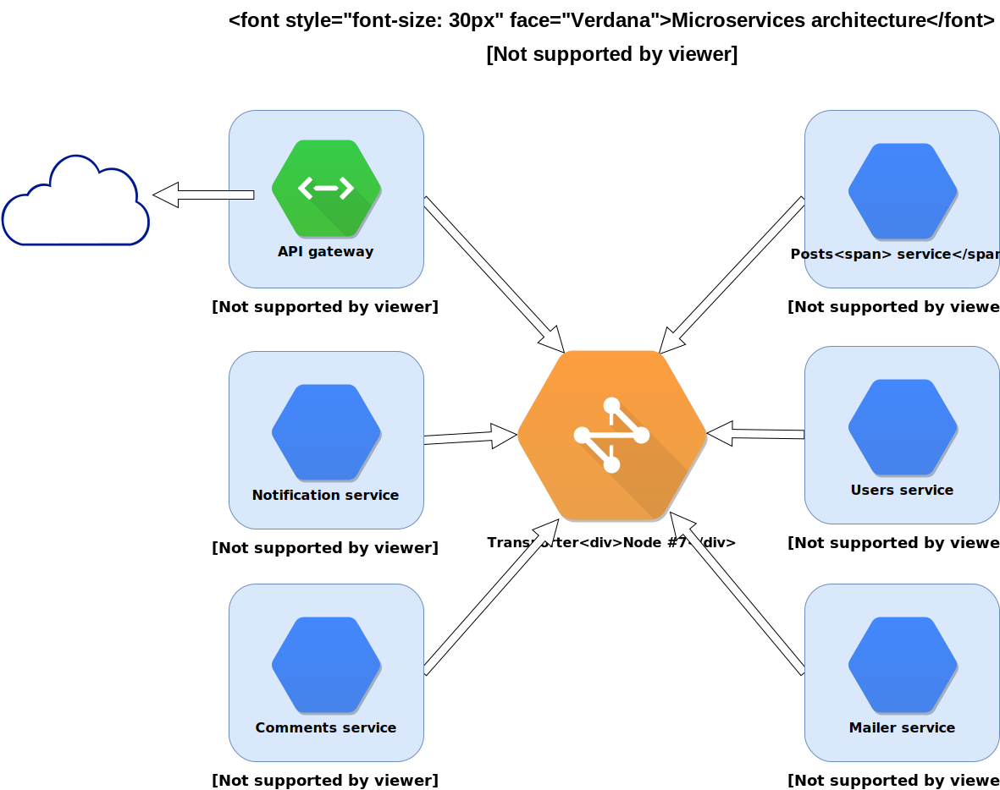

title: Clustering
---
Moleculer framework supports several software architectures.

## Monolith architecture
In this version, all services are running on the same node like a monolith. There is no network latency and no transporter module. _The local calls are the fastest._

## Microservices architecture
This is the well-known microservices architecture when all services are running on individual nodes and communicate via transporter. In this case, the network latency is not negligible. However, your services can be scaled to be resilient and fault-tolerant.

## Mixed architecture
In this case, we are running coherent services in a group on the same node. It combines the advantages of monolith and microservices architectures. For example, if the `posts` service calls the `users` service multiple times, put them to the same node, so that the network latency between these services is cut down. If the node is overloaded, just scale it up.


The ServiceBroker first tries to call the local instances of service (if exists) to reduce network latencies. This logic can be turned off in [broker options](configuration.html#Broker-options) with `preferLocal: false` property under the `registry` key.


## How choose
Do you choose between monolith and microservices when developing your application? Do you choose monolith approach because its easy to develop? Do you prefer microservices architecture because it is reliable and highly scalable? With Moleculer you don't have to choose. You can have the best of both approaches. During the development of your application load all services is single node. This way you can quickly debug and test of your application logic. When ready, simply distribute your services across multiple nodes. Don't worry, you don't have to change a single line of code in your services. Just select a transporter, load one service per node and you're done. Your application is running in microservices architecture.